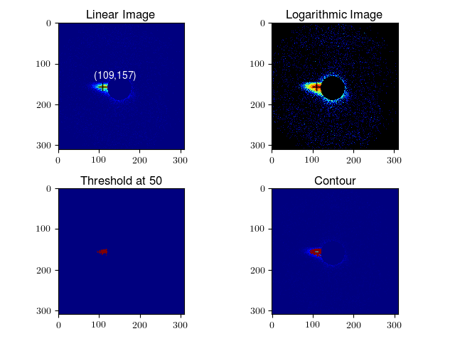
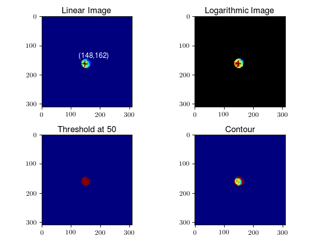
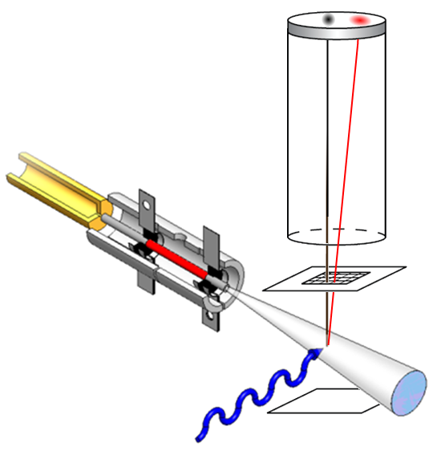
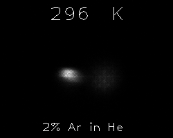
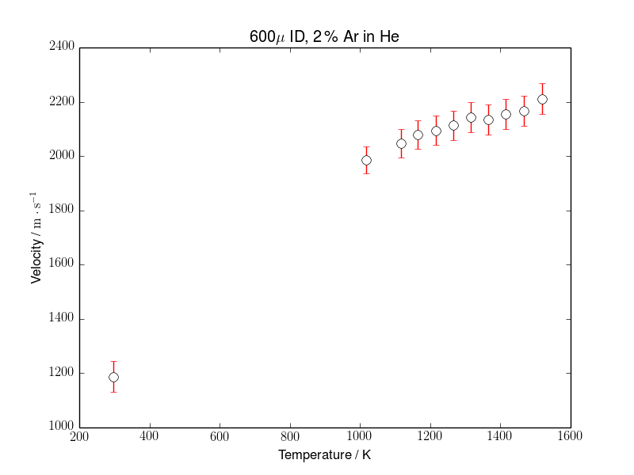

# velocity-map-image-processing
A velocity map imaging processing suite for automated centroiding, masking, multipeak fitting, and visualization with numerical and computer vision libraries.

## Overview

**velocity-map-image-processing** is designed to process 2D imaging data recorded from a velocity-map imaging apparatus where two distinct velocity components are present. However, this could be adpated/applied to any image data where two components are present. For a complete description of the implimentation of these scripts in my research, see the motivation section at the end.
These scripts were created for use with python 2.7.6 on the Windows command line. While not tested on a Posix system, they should theoretically work. Image data is processed according to the following steps.

* Part 1: Centroid (`centroid.py`)
 * read, reshape, and subset 1D data column into 2D numpy data
 * mask data (if mask supplied)
 * threshold
 * find contours and moments (centroids)
 * plot/save centroid/mask visualizations
 
* Part 2: Slicing & Fitting (`slice_fit.py`)
 * extract data slice along line defined by two centroids
 * fit two gaussians to data slice using centroids as guess
 * plot/save slice, fits, and parameters

## Dependencies

* Python 2+ (tested on 2.7.6 MSC v.1500 32 bit (Intel))
 * opencv (2.4.13)
 * numpy (1.11. 2)
 * matplotlib (2.0.0b4)
 * scipy (0.18.1)
 
## Usage

velocity-map-image-processing is executed with two scritps ([centroid.py](centroid.py), [slice_fit.py](slice_fit.py)). These are called from the command line with user-specified arguments.

```
python centroid.py \path\to\data threshold minimum_area mask_name 

python slice_fit.py \path\to\data centroid_1_x centroid_1_y centroid_2_x centroid_2_y
```

### Centroiding Without Masking

Using this script with the provided [sample.dat](sample.dat).

```
C:\path\to\script> python centroid.py sample.dat 20 30 

No Masking.

centroids = 78 156 148 162
distance = 70
userThreshold = 20
area minimum = 30
```

This will generate 4 files:
* .png and .pdf indicating the centroids, thresholded image, and contour regions


* grey scale .png of the subset data


* text file containg the centroids and parameters, [sample_CENTROIDS.txt](sample_CENTROIDS.txt).

### Slice Through Centroid and Multipeak Fitting

Now using those centroid points from the output of `centroid.py` we can fit the data along the slice between the two centroid points.

```
C:\path\to\script> python slice_fit.py sample.dat 78 156 148 162
```
This generates 5 files:
* an .png visualizing the line of data sliced through the centroids


* .png and .pdf demonstrating the multi-peak gaussian fitting along the data slice


* text file containg the data slice, fits, fits sum, residuals: [sample_CENTROIDS.txt](sample_FITS.txt)

### Centroiding With Masking

When thresholding cannot separate the components (such as when the image components are overlapped) the centroiding fails to find the centers. To solve this issue we can introduce image masking in order to isolate the highest intensity centers of each component. Masking is achieved by providing a binary image mask that will isolate the desired components.

Using [sample_mask.dat](sample_mask.dat). Without masking we find the [centroid.py](centroid.py) routine fails where a low threshold (20) convolves both components and a higher threshold segments the lower intensity component and fails to centroid as demonstrated below.


By providing a unique mask for each component we can find their centers separately. Binary image masks can be made with any basic image software such as Windows paint whereby black parts of the image will be masked (ignored). Masks should be the same size as the image data. We can process these data with the two masks pictured below.


Running [centroid.py](centroid.py) independently with each mask enables us to determine each centroid for fitting. First with [outer mask.png](outer_mask.png).

```
C:\path\to\script> python centroid.py sample.dat 20 30 mask_outer.png

Masking.

centroids = 109 157
distance = undefined
userThreshold = 50
area minimum = 30
```


The same treatment with [inner_mask.png](inner_mask.png) determines the inner-component centroid.



We can now run the [slice_fit.py](slice_fit.py) with these centroids to achieve the fit below.
```
C:\path\to\script> python slice_fit.py sample_mask.dat 109 157 148 162
```


## Motivation

In my collaborative research at [Berkeley Labs](http://lbl.gov), we use a silicon carbide (SiC) thermal reactor nozzle to probe chemistry at high temperatures (25 - 1500C). One of the problems we faced in these studies was determing how close the temperature of the reactor (measured with a thermocouple) is to the temperature of the gas inside the reactor. By using a technique known as velocity map imaging we can 'ionize' the hot gas and image the ions as a function of their velocity. Since temperature can be considered to be a measure of average kinetic energy (velocity) we can use this technique to determine the average temperature of the gas emanating from the nozzle. The experimental schematic is depicted below.



Here we see the thermal reactor nozzle (left) emitting the gas between two postiviely charged plates. We use high energy photons from the [Advanced Light Source](http://als.lbl.gov) to kick-out electrons (ionize) the hot gas which subsequently feel the postive charge between the plates casuing them to rush up the flight-tube. We see two paths of the ions here as black and red lines. The black line represents the path of ions formed from background gas while the red line shows the path of ions formed from the hot gas coming from the nozzle. Since the hot gas has momentum in the nozzle axis it conserves that momentum on its journey to the detector. This manifests as an offset from the center of the detector proportional to the average velocity (temperature) of the gas. When we make these measurements at a variety of temperatures we find the hotter the reactor (as measured by the thermocouple) the greater the velocity of the hot gas in the nozzle axis. This is depicted as an animated gif below.



In order to process this data and extract a velocity of the hot gas I had to first determine the relationship between pixel and velocity. In order to work out the per-pixel velocity under our conditions we turned to a system that fragments with a specific energy, namely oxygen. Using that oxygen fragmentation data we determined our per-pixel velocity allowing us to back out a temperature for each image. For more information on this process see the [summary report](summary_report.pdf).

However, we were required to explore this temperature-velocity relationship under a large parameter space, namely: nozzle diameter; gas ratio; and flow rate, each under a variety of conditions. This quickly led to a large data set with over 2000 samples, each about 10MB. Processing such data manually would be extermely time consuming and prone to error and inconsistency. Using this **velocity-map-image-processing** suite I was able to rapidly and systematically reduce this large data and programmatically generate informative visualizations summarising the velocity vs temperature data under the total parameter space. A temperature series for one parameter space can be seen below.



